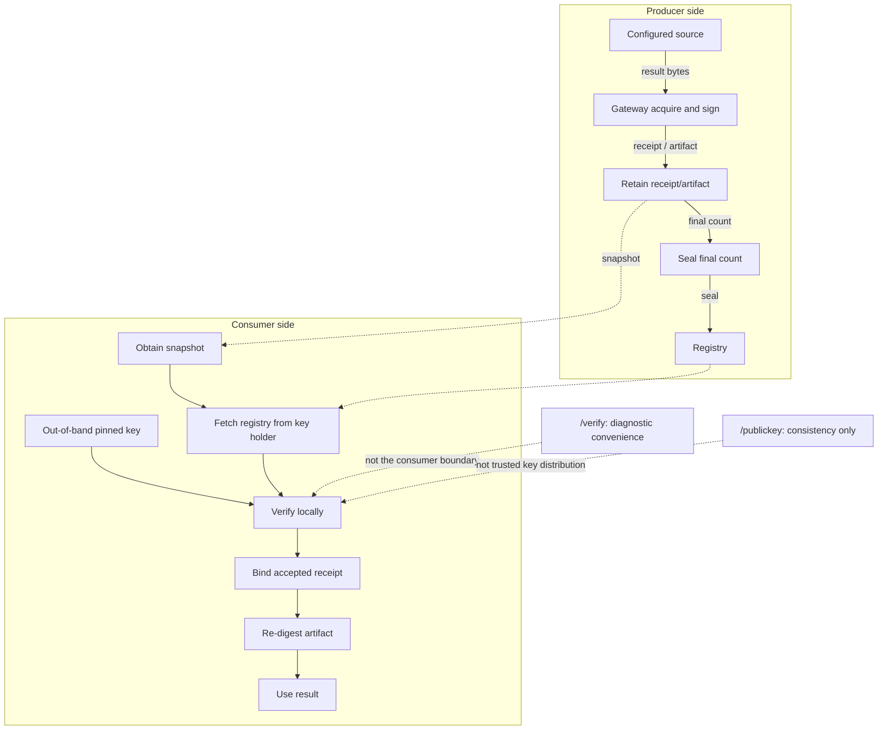

# judgment-pack-gateway

The **open reference gateway** for judgment-pack: a small hosted service that
attests the inputs a pack is judged on, under one protected signing identity, and
seals each session so a verifier can catch replay and rollback.

It is the *hosted deployment shape* of the trustworthy-input-acquisition research
line ([judgment-pack-evaluator-experiments](https://github.com/Judgment-Pack/judgment-pack-evaluator-experiments),
ADR-0002). That line asked a narrow question — **where do a pack's inputs come from,
and what makes them trustworthy?** — and answered it with a ceiling stated up front:
you can prove *byte-lineage*, not truth. A judgment is only as trustworthy as the
bytes it was computed over, so the honest goal is to put those bytes on a proof path
the model cannot forge, and to say exactly where that proof stops.

## What it does

- **Acquire.** A caller asks the gateway to acquire a result from a configured
  source. The gateway runs the source, content-addresses the result, and **signs**
  its canonical form under the gateway's Ed25519 identity, chained to the session's
  prior receipts. The caller **cannot supply a receipt** — the gateway produces every
  one. This is what takes the model out of the proof path: an agent can assert
  anything, but it cannot manufacture the gateway's signature.
- **Seal.** When a session closes, the gateway seals its final receipt count in an
  append-only registry under the same key.
- **Verify.** A verifier fetches the registry from the gateway (not from the store)
  and checks the store against it **using only the public key** — checking grants no
  power to forge. Per-receipt integrity comes from the signatures; the seal adds what
  a store cannot attest about itself — that a whole
  session was **replayed** into it, or that a session's **tail was rolled back**.



The executable form of the consumer flow is
[SPEC.md §5a](SPEC.md#5a-consuming-an-attestation) and
[go/ceremony_test.go](go/ceremony_test.go).

The registry is the reason the gateway exists. The inline attestation core proved
each receipt; it left two residuals it structurally could not catch on its own,
because both need an anchor *outside* the store. The gateway is that anchor. See
[`SPEC.md`](SPEC.md) for the seal contract and the exact findings, and
[`go/service_test.go`](go/service_test.go) for the demonstration — including the
contrast that per-receipt verification *passes* the same replayed and truncated
stores the registry-anchored verification rejects.

## Run it

One Go binary, standard library only, binds localhost.

```
cd go && go build -o gateway .

./gateway keygen gateway.seed      # prints the public key and key id to pin
```

The `serve` command below references `./my_source`. Create it first in a POSIX/WSL shell:

```sh
cat > my_source <<'EOF'
#!/bin/sh
# Consume the canonical arguments supplied on stdin, then emit one JSON result.
cat >/dev/null
printf '%s\n' '{"synthetic":true,"subject":"acme"}'
EOF
chmod +x my_source
```

The fixture is synthetic: it demonstrates the source-command interface only, and its
output is not evidence that a real screening occurred. On native Windows, replace it
with any executable that reads the canonical arguments on stdin and writes one JSON
result object to stdout.

```
./gateway serve ./store gateway.seed gateway:demo ./registry.jsonl \
    --source screening='./my_source' --port 8787
```

`keygen` prints the public key precisely because it has to be pinned **out of
band** — see Honest bounds.

```
curl -s localhost:8787/acquire -d '{"session":"s1","source":"screening","arguments":{"subject":"acme"}}'
curl -s localhost:8787/seal    -d '{"session":"s1"}'
curl -s localhost:8787/verify              # the gateway grading itself -- a diagnostic, not evidence (SPEC.md §5a.3)
curl -s localhost:8787/registry            # the anchor a verifier fetches from the key holder
curl -s localhost:8787/publickey           # consistency only: a real verifier uses the key pinned from keygen, never this
```

The gateway mints version 3 receipts (SPEC.md §1.2a): `/acquire` answers
`{result, receipt, salts}`, where `salts.args` is the 32-byte salt behind the receipt's
arguments commitment, returned here and retained nowhere. Revealing the arguments to an
auditor takes the salt, so whoever holds it can, and nobody else; this reference hands it
over plaintext localhost HTTP, so the holder is whoever can read that exchange. A bare
`--source` command is the `"command"` shape: its acquisition record names the command
and the digest of the file its first word resolved to, read just before the source is
started, and says nothing else was known — a directly executed script is digested as the
script, while `python3 fetch.py` is digested as the interpreter and the script is an
argument the record does not repeat; `observedAt` is the gateway's own stamp of when
it had read the source's output in full, since a command records nothing.
`--receipt-version 2` keeps the version 2 form for a consumer not yet updated.

A source declared with `--source-shape NAME=airbyte|mcp|http` is an adapter
([ADR-0002](docs/adr/0002-adapters-report-in-the-envelope.md)): its stdout is an
envelope, `{acquisition, result, page?}`, and the receipt records the acquisition as the
adapter reported it — endpoint, snapshot, schema, the adapter that fetched — under the
shape the operator declared, with the statement committed under its own salt
(`salts.statement`) and, for a page, the digest of every item. A defective envelope
fails the acquisition; nothing is minted. What that record is, exactly, is the
adapter's testimony under the gateway's signature, and SECURITY.md says so.

A consumer does not stop at those endpoints: it runs `gateway verify` itself, over
a store it holds, under the key it pinned from `keygen`'s output, then binds the
receipt and re-digests the artifact before using a byte — the normative sequence
is [SPEC.md §5a](SPEC.md), executable in `go/ceremony_test.go`.

A source is any command that reads the canonical arguments on stdin and writes a JSON
result on stdout. The gateway attaches no transport of its own; it attests whatever
bytes a source returns — **proof of the bytes, not proof of their truth.**

A source is started with the environment declared for it, plus `PATH`, and nothing
else of the gateway's. `--source-env NAME=KEY=VALUE` sets a variable for source `NAME`;
`--source-env NAME=KEY` copies that one variable from the gateway's environment at
spawn time, which is for passing a path through by name, not a secret — a secret in
the gateway's environment is in the signer's memory whatever is declared. On Windows,
`SYSTEMROOT` is the one variable os/exec adds undeclared. `--source-user NAME=USER`
runs a source as another OS user with that user's own groups (Unix; requires root,
refused otherwise rather than run as the signer). `--source-max-output BYTES` bounds
what a source may write on stdout (one mebibyte by default); past it the source is
killed — on Unix its whole process group, elsewhere the direct child — and the
acquisition fails, and a descendant that outlives the kill gets a bounded wait rather
than the acquisition. On Unix, `serve` refuses a seed file that is not a regular file
owned by the gateway's own user and readable by it alone, says which `chmod` to run,
and marks every descriptor its launcher left open close-on-exec so none reaches a
source; on Windows it checks that the seed is a regular file and says the rest is the
filesystem's. What this does not give: a source that runs as the gateway's own user can
read what that user can read, and a gateway that runs as root can read the files a
source user holds. The separation is as strong as the identities the operator gives
the two sides; [SECURITY.md](SECURITY.md) states it in full.

```
cd go && go test ./... && ./gateway conform     # the frozen corpus is the arbiter
```

## Honest bounds

Stated plainly because the whole line is about being exact where proof stops:

- A receipt (and a seal) is an **Ed25519 signature under an operator-configured
  authority label** — proof of byte-lineage to the key holder, not proof that a
  genuinely-named source produced the bytes. The recorded source/authority is a
  label, not an authenticated origin.
- **Verification needs only the public key**, so checking grants no power to forge.
  But the public key must be pinned out of band: fetching it from the gateway you
  are auditing proves consistency, not authenticity.
- Signing uses Go's standard library `crypto/ed25519` — vetted and constant time.
  (An earlier revision carried hand-written pure-Python Ed25519 that was neither;
  retiring it removed the caveat rather than mitigating it.)
- The registry closes replay and rollback **relative to a verifier that trusts the
  gateway's registry over the store**. It does not defend a compromised gateway: key
  disclosure forges everything.
- This is a **single-identity, single-operator reference**, localhost, no authn on
  the HTTP surface, no HA. It is for self-hosting a trust root and demonstrating the
  mechanism — not a hardened public deployment.

## Where this is going

The source contract above is the gateway's whole integration surface, and every source
that exists is a script someone wrote by hand. [docs/adr/0001](docs/adr/0001-one-engine-four-processes.md)
records the direction: a second module, `adapters/`, that reaches the catalogs that
already exist — connector images for bulk and historical reads, the MCP servers vendors
publish for live reads and writes — and a release that ships the gateway, the adapters
and the runtime as one image with one configuration file. Inside that image the signer
runs alone with the seed, each adapter runs as its own process with one platform's
credentials, and neither imports the other; `go/boundary_test.go` and
`adapters/boundary_test.go` make the import rule a test, and the design notes state what
the tests cannot: what each process may read, and which deployment choices would undo it.
The receipt format
this needs, version 3, is normative in [SPEC.md §1.2a](SPEC.md) with vectors under
`corpus/v3/`, and is what `serve` mints; its design record is
[docs/design/receipt-v3.md](docs/design/receipt-v3.md). The first two adapters are in
[adapters/](adapters/README.md): `adapter-airbyte`, a pinned connector image run through
the operator's container runtime, one page of one stream per acquisition, and
`adapter-mcp`, a client of a vendor's MCP server over stdio, one tool call per
acquisition — wired to `serve` with `--source-shape NAME=airbyte` and `NAME=mcp`.

```
go/          the core: canon, sign, seal, verify, conform, serve — standard library only
adapters/    what reaches outside, spawned by the core over the source contract, never linked
corpus/      the frozen vectors both answer to
docs/adr/    why the repository is shaped this way
docs/design/ what is designed and not yet decided
```

## Why this repo is open

The format, the registry contract, and the verifier are all here and inspectable, on
purpose: **an attestation nobody can verify is worth nothing.** Verifiability is a
property of the ecosystem, not of one operator, so the parts a third party needs to
check a receipt or a seal without trusting the operator — the receipt format,
canonicalization, the seal contract, and `verify_with_registry` — are open and stay
open. That is the mandatory-open core.

A *managed* operation of this same mechanism — a credentialed, multi-tenant, highly
available, multi-source hosted service with a durable trust root — is a separate
concern and a reasonable commercial one. The open/commercial line is drawn at
verifiability, not at operation: anyone may verify; running the trust root at scale
for others is the hosted product. Nothing in a paid deployment may make a receipt
verifiable *only* through that operator; if it did, it would not be a judgment-pack
attestation.

## License

Apache-2.0. See [LICENSE](LICENSE).
